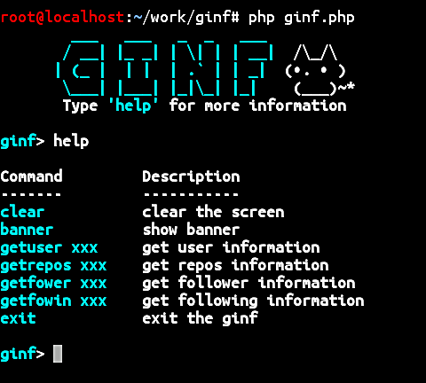

# GINF
Using Github API to gathering information about the user, repository, follower and also the following.

## Screenshot


## Installation and Using GINF
```
apt-get install git php
```
```
git clone https://github.com/Gameye98/GINF
```
```
cd GINF
```
```
php ginf.php
```

## API
https://api.github.com/users/Gameye98
https://api.github.com/users/Gameye98/repos
https://api.github.com/users/Gameye98/followers
https://api.github.com/users/Gameye98/following
